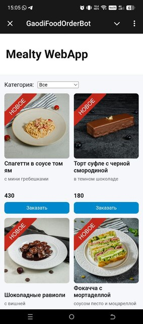
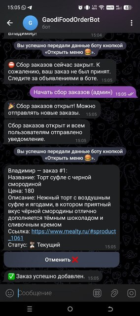

# Gaodi Food Bot & WebApp

Telegram-бот и WebApp для сбора заказов c группы и последующего заказа одним человеком через сайт mealty.ru

## Быстрый запуск

```bash
# бот
cd bot && ./start.sh

# вебапп
cd webapp && ./start.sh
```
Скрипты сами создают виртуальные окружения и запускают сервисы. Для автозапуска используйте systemd юниты: `gaodi_food_bot.service` и `gaodi_food_webapp.service`.

## Команды

**Пользователи:**
- /start — регистрация и главное меню
- /my_current — текущие заказы
- /my_past — прошлые заказы
- /help — справка

**Администраторы:**
- /password_set <пароль> — задать пароль для пользователей
- /password — посмотреть текущий пароль
- /add_admin <user_id> — добавить администратора
- /del_admin <user_id> — удалить администратора
- /del_user <user_id> — удалить пользователя
- /rename_user <user_id> <новое_имя> — переименовать пользователя
- /list_users — список всех пользователей
- /users_blacklist — список заблокированных пользователей
- /users_remove_blacklist <user_id> — убрать пользователя из черного списка
- /start_collection — открыть сбор заказов
- /close_collection — закрыть сбор заказов
- /all_orders — показать все текущие заказы



